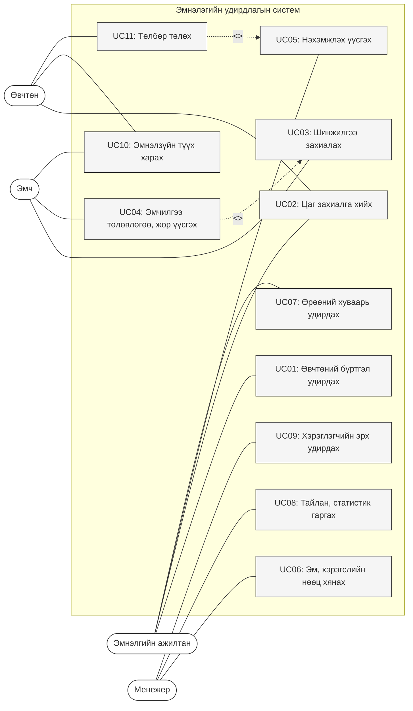

# Эмнэлэгийн удирдлагын системийн Use Case Диаграмм

```mermaid
graph LR
    %% Actors
    Actor1(["Эмнэлгийн ажилтан"])
    Actor2(["Эмч"])
    Actor3(["Менежер"])
    Actor4(["Өвчтөн"])
    
    %% Use Cases
    subgraph "Эмнэлэгийн удирдлагын систем"
        direction TB
        UC01["UC01: Өвчтөний бүртгэл удирдах"]
        UC02["UC02: Цаг захиалга хийх"]
        UC03["UC03: Шинжилгээ захиалах"]
        UC04["UC04: Эмчилгээ төлөвлөгөө, жор үүсгэх"]
        UC05["UC05: Нэхэмжлэх үүсгэх"]
        UC06["UC06: Эм, хэрэгслийн нөөц хянах"]
        UC07["UC07: Өрөөний хуваарь удирдах"]
        UC08["UC08: Тайлан, статистик гаргах"]
        UC09["UC09: Хэрэглэгчийн эрх удирдах"]
        UC10["UC10: Эмнэлзүйн түүх харах"]
        UC11["UC11: Төлбөр төлөх"]
    end
    
    %% Relationships - Эмнэлгийн ажилтан
    Actor1 --- UC01
    Actor1 --- UC02
    Actor1 --- UC05
    Actor1 --- UC07
    
    %% Relationships - Эмч
    Actor2 --- UC03
    Actor2 --- UC04
    Actor2 --- UC10
    
    %% Relationships - Менежер
    Actor3 --- UC06
    Actor3 --- UC08
    Actor3 --- UC09
    
    %% Relationships - Өвчтөн
    Actor4 --- UC02
    Actor4 --- UC10
    Actor4 --- UC11
    
    %% Use Case Relationships
    UC04 -.-> |"<<include>>"| UC03
    UC11 -.-> |"<<include>>"| UC05
    
    %% Styling
    classDef useCase fill:#f5f5f5,stroke:#333,stroke-width:1px;
    classDef actor fill:white,stroke:#333,stroke-width:1px;
    
    class UC01,UC02,UC03,UC04,UC05,UC06,UC07,UC08,UC09,UC10,UC11 useCase;
    class Actor1,Actor2,Actor3,Actor4 actor;
```
