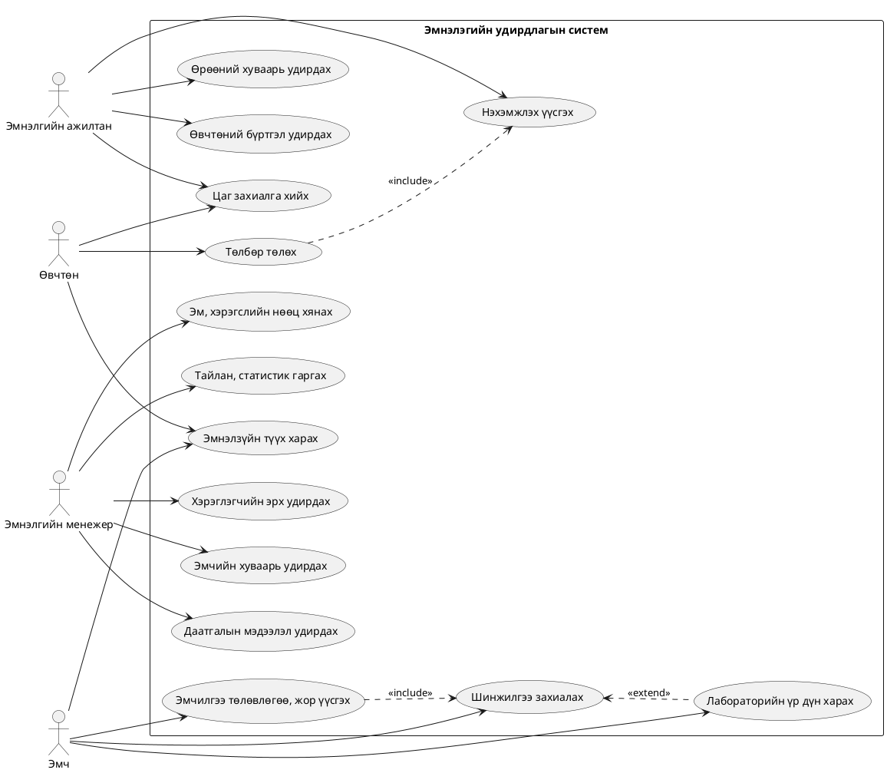

```plantuml
@startuml "Эмнэлэгийн удирдлагын системийн Use Case Диаграмм"

left to right direction
skinparam packageStyle rectangle

actor "Эмнэлгийн ажилтан" as Staff
actor "Эмч" as Doctor
actor "Эмнэлгийн менежер" as Manager
actor "Өвчтөн" as Patient

rectangle "Эмнэлэгийн удирдлагын систем" {
  usecase "Өвчтөний бүртгэл удирдах" as UC1
  usecase "Цаг захиалга хийх" as UC2
  usecase "Шинжилгээ захиалах" as UC3
  usecase "Эмчилгээ төлөвлөгөө, жор үүсгэх" as UC4
  usecase "Нэхэмжлэх үүсгэх" as UC5
  usecase "Эм, хэрэгслийн нөөц хянах" as UC6
  usecase "Өрөөний хуваарь удирдах" as UC7
  usecase "Тайлан, статистик гаргах" as UC8
  usecase "Хэрэглэгчийн эрх удирдах" as UC9
  usecase "Эмнэлзүйн түүх харах" as UC10
  usecase "Төлбөр төлөх" as UC11
  usecase "Эмчийн хуваарь удирдах" as UC12
  usecase "Даатгалын мэдээлэл удирдах" as UC13
  usecase "Лабораторийн үр дүн харах" as UC14
}

Staff --> UC1
Staff --> UC2
Staff --> UC5
Staff --> UC7

Doctor --> UC3
Doctor --> UC4
Doctor --> UC10
Doctor --> UC14

Manager --> UC6
Manager --> UC8
Manager --> UC9
Manager --> UC12
Manager --> UC13

Patient --> UC2
Patient --> UC10
Patient --> UC11

UC4 ..> UC3 : <<include>>
UC11 ..> UC5 : <<include>>
UC3 <.. UC14 : <<extend>>

@enduml
```
