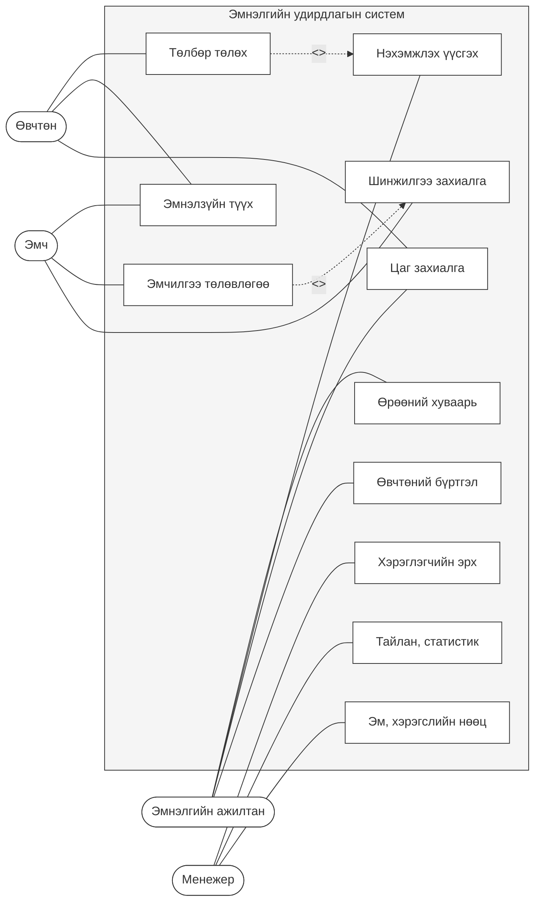

# Эмнэлэгийн удирдлагын системийн Use Case Диаграмм

## Тайлбар

### Актёрууд:
- **Эмнэлгийн ажилтан**: Хүлээн авах, бүртгэл хариуцсан ажилтан
- **Эмч**: Өвчтөн үзэх, эмчилгээ бичих мэргэжилтэн
- **Менежер**: Удирдлага, хяналт тавих удирдах ажилтан
- **Өвчтөн**: Эмнэлгийн үйлчилгээ авагч

### Хэрэглээний тохиолдлууд (Use Case):
- **Өвчтөний бүртгэл**: Өвчтөний мэдээлэл бүртгэх, өөрчлөх
- **Цаг захиалга**: Эмчид үзүүлэх цаг товлох, цуцлах
- **Шинжилгээ захиалга**: Шинжилгээний захиалга үүсгэх, хянах
- **Эмчилгээ төлөвлөгөө**: Өвчтөны эмчилгээний төлөвлөгөө, жор бичих
- **Нэхэмжлэх үүсгэх**: Үйлчилгээний төлбөрийн нэхэмжлэх гаргах
- **Эм, хэрэгслийн нөөц**: Эм, эмнэлгийн хэрэгслийн бүртгэл, хяналт
- **Өрөөний хуваарь**: Эмнэлгийн өрөө, тасгийн хуваарилалт
- **Тайлан, статистик**: Үйл ажиллагааны тайлан, мэдээ гаргах
- **Хэрэглэгчийн эрх**: Системийн хэрэглэгчдийн эрх, хандалт
- **Эмнэлзүйн түүх**: Өвчтөний эмнэлзүйн түүх, оношлогоо
- **Төлбөр төлөх**: Үйлчилгээний төлбөр төлөх

### Харилцаа холбоо:
- **«include»**: Нэг Use Case нь өөр нэг Use Case-г заавал агуулж байгааг илэрхийлнэ
